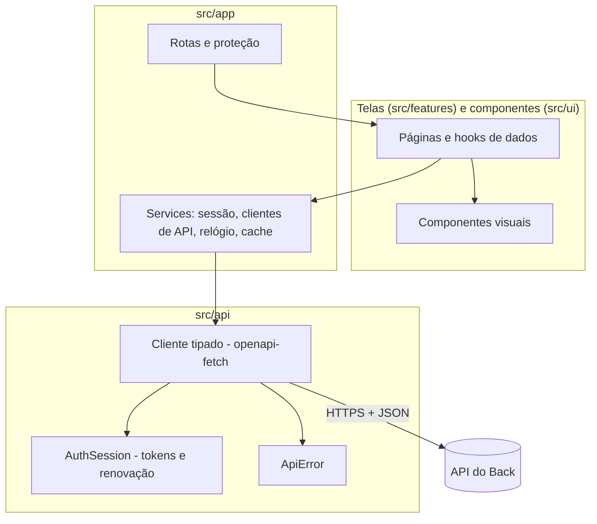

# Arquitetura do Front

Uma SPA (aplicação de página única) que só **mostra e envia**: as regras dos jogos, a pontuação e a autorização vivem no servidor. O cliente nunca decide quem ganhou nem o que alguém pode ver.

## Camadas

| Pasta                 | Papel                                                                                                                               |
| --------------------- | ----------------------------------------------------------------------------------------------------------------------------------- |
| `src/api`             | tudo o que fala com o servidor: tipos gerados do OpenAPI (`schema.d.ts`), cliente, erros (`ApiError`), tokens e renovação de sessão |
| `src/app`             | montagem: serviços (`createServices`), provedores, rotas, proteção de rotas (`RequireAuth`), tela de "atualize o app"               |
| `src/features/<área>` | telas e hooks de cada área (auth, groups, sessions, games, ranking, profile, legal)                                                 |
| `src/ui`              | componentes visuais sem regra de negócio (Button, Card, Avatar, TextField, Dialog, Toast...)                                        |
| `src/lib`             | utilidades puras (telefone, relógio do servidor, versão)                                                                            |
| `src/styles`          | tokens de cor/fonte (do guia visual do app original) e estilos base                                                                 |
| `src/test`            | ajudantes de teste (servidor de mentira, montagem do app inteiro)                                                                   |

## Sessão e tokens

- **Access token** (30 min) e **refresh token** (90 dias, uso único) ficam no `localStorage` (`TokenStore`). O armazenamento é a fonte da verdade entre abas.
- `AuthSession` renova **uma vez por vez**: dentro da aba, todas as chamadas esperam a mesma promessa; entre abas, um _lock_ do navegador (Web Locks) e uma releitura do armazenamento fazem a segunda aba usar o par novo em vez de gastar o refresh token de novo (o que derrubaria a sessão, como medida contra roubo).
- O cliente autenticado renova antes de o token vencer e, num `401`, renova e repete a requisição **uma vez**. Falha de rede na renovação não desloga ninguém; refresh token inválido, sim.
- Sair (ou perder a sessão) limpa o cache de dados, para a próxima pessoa do aparelho não ver nada da anterior.

## Dados do servidor

TanStack Query cuida de cache, recarga e erros. Cada área tem seus hooks (`useGroups`, `useMe`...). Erros viram `ApiError` com `code` estável (para decidir o que fazer) e `detail` em português (para mostrar). Falhas de rede e 5xx tentam de novo sozinhas; 4xx não.

## Tempo real e relógio

Os prazos dos jogos (preparo, cronômetro, chance de roubo) vêm do servidor em UTC. O `ServerClock` corrige a diferença do relógio do aparelho usando `GET /meta`; o cronômetro na tela é só uma projeção desses prazos. O SignalR só **avisa e entrega a visão**; agir é sempre pelo REST (ver `docs/REALTIME.md` do Back).

## Estilo

CSS Modules (sem biblioteca de componentes). Paleta e fontes do app original: roxo, magenta, amarelo; Bitter nos títulos e Nunito no texto; contorno grosso e sombra dura, botões grandes (legíveis para todas as idades); modo escuro automático. Tudo em português (pt-BR).

## Testes

- Unidade: erros, telefone, relógio, tokens, sessão (incluindo duas abas), versão.
- Integração de tela: o app inteiro (rotas + provedores) contra um servidor de mentira (`src/test/renderApp.tsx`), simulando o que a API responde.
- Verificação manual contra o Back de verdade: `npm run dev` com a API local.
