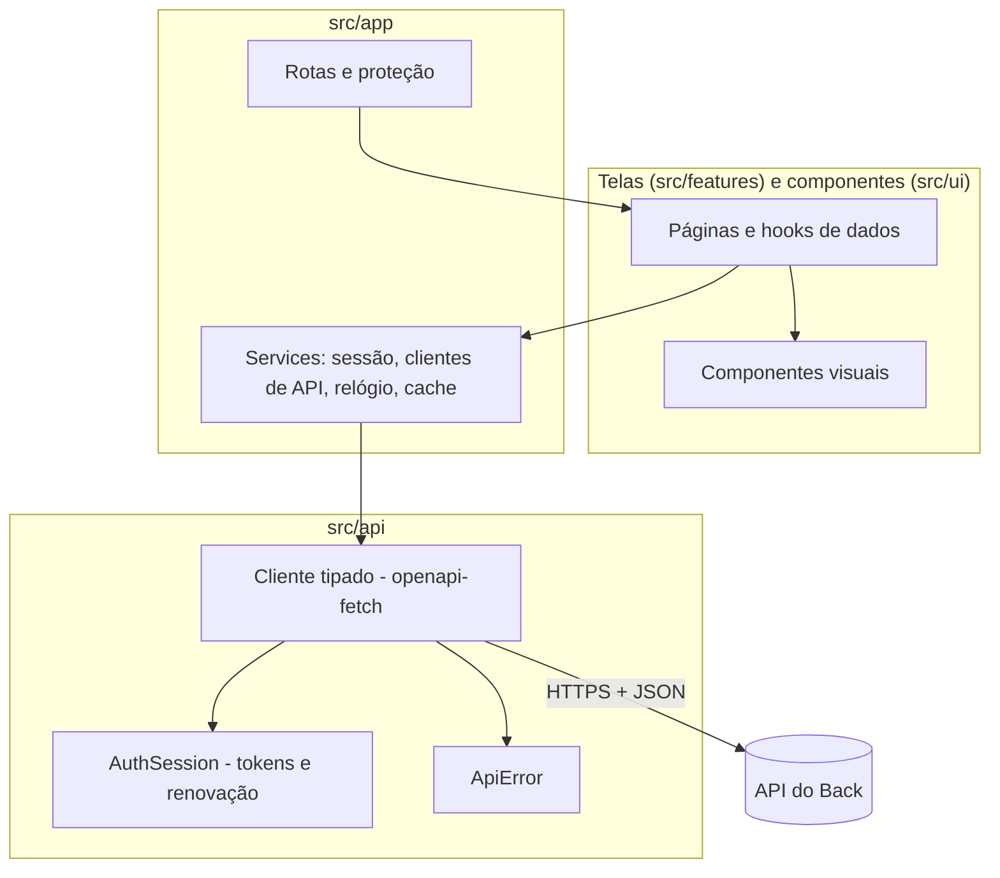

# Arquitetura do Front

Uma SPA (aplicação de página única) que só **mostra e envia**: as regras dos jogos, a pontuação e a autorização vivem no servidor. O cliente nunca decide quem ganhou nem o que alguém pode ver.

## Camadas

| Pasta                 | Papel                                                                                                                               |
| --------------------- | ----------------------------------------------------------------------------------------------------------------------------------- |
| `src/api`             | tudo o que fala com o servidor: tipos gerados do OpenAPI (`schema.d.ts`), cliente, erros (`ApiError`), tokens e renovação de sessão |
| `src/app`             | montagem: serviços (`createServices`), provedores, rotas, proteção de rotas (`RequireAuth`), tela de "atualize o app"               |
| `src/features/<área>` | telas e hooks de cada área (auth, groups, sessions, games, ranking, profile, legal)                                                 |
| `src/ui`              | componentes visuais sem regra de negócio (Button, Card, Avatar, TextField, Dialog, Toast...)                                        |
| `src/lib`             | utilidades puras (telefone, relógio do servidor, versão)                                                                            |
| `src/styles`          | tokens de cor/fonte (do guia visual do app original) e estilos base                                                                 |
| `src/test`            | ajudantes de teste (servidor de mentira, montagem do app inteiro)                                                                   |

## Sessão e tokens

- **Access token** (30 min) e **refresh token** (90 dias, uso único) ficam no `localStorage` (`TokenStore`). O armazenamento é a fonte da verdade entre abas.
- `AuthSession` renova **uma vez por vez**: dentro da aba, todas as chamadas esperam a mesma promessa; entre abas, um _lock_ do navegador (Web Locks) e uma releitura do armazenamento fazem a segunda aba usar o par novo em vez de gastar o refresh token de novo (o que derrubaria a sessão, como medida contra roubo).
- O cliente autenticado renova antes de o token vencer e, num `401`, renova e repete a requisição **uma vez**. Falha de rede na renovação não desloga ninguém; refresh token inválido, sim.
- Sair (ou perder a sessão) limpa o cache de dados, para a próxima pessoa do aparelho não ver nada da anterior.

## Dados do servidor

TanStack Query cuida de cache, recarga e erros. Cada área tem seus hooks (`useGroups`, `useMe`...). Erros viram `ApiError` com `code` estável (para decidir o que fazer) e `detail` em português (para mostrar). Falhas de rede e 5xx tentam de novo sozinhas; 4xx não.

## Partidas, tempo real e relógio

- **O servidor é a fonte da verdade.** A tela da partida mostra o que o servidor devolve para quem consulta (`GET /sessions/{id}`, a resposta de uma ação ou a mensagem do tempo real), nunca deduz regras. Os botões vêm de `allowedActions`, e a carta só aparece para quem o servidor mostra.
- **Tempo real (SignalR) só avisa e entrega a visão** (`LiveHub`/`SignalRHub`): uma conexão para o app inteiro, que assina de novo tudo o que está sendo assistido ao reconectar (o `Subscribe` devolve o estado completo, então nada se perde), volta sozinha quando o token vence e fecha depois de um tempo sem ninguém assistindo. Agir é sempre pelo REST, com `clientActionId` (idempotente) e uma nova tentativa em conflito de concorrência. O cliente SignalR só é baixado ao abrir uma partida (`LazyHub`).
- **A versão só sobe** (`reconcileSession`): mensagem atrasada é ignorada. Uma busca explícita vale também com a mesma versão, porque algumas fases mudam só com o relógio (o preparo da Mímica vira "valendo" depois de 3 s sem gravar nada); por isso o app pede o estado de novo logo depois de cada prazo (`useRefetchAfter`). Sem tempo real, busca a cada 4 s.
- **Relógio:** os prazos vêm em UTC do servidor. O `ServerClock` corrige a diferença do relógio do aparelho usando `GET /meta`; o cronômetro é só uma projeção desses prazos.
- **Jogos:** o catálogo (`GET /games`) diz o que está instalado; a tela de cada jogo vive em `src/features/games/<jogo>` e é registrada em `registry.ts` (ver [GAMES.md](GAMES.md)). Jogo que o app não conhece aparece sem botão de jogar e pede para atualizar.

## Pacote

Telas pouco usadas (partidas, ranking, perfil, textos legais) são rotas preguiçosas, e o SignalR é um pacote à parte: o início e a entrada baixam só o essencial (~95 KB comprimidos). Fontes só em latin/latin-ext, hospedadas junto (nada de requisição a terceiros, exceto o Cloudflare Turnstile quando ligado).

## Instalação como app

O manifesto (`public/manifest.webmanifest`) e os ícones PNG (`npm run icons`) permitem "Adicionar à tela inicial" no celular. Não há _service worker_: o jogo precisa de internet o tempo todo, então cache offline não ajudaria.

## App Android

O mesmo `dist/` empacotado num WebView pelo Capacitor (pasta `android/`, ver [ANDROID.md](ANDROID.md)). O que é do aparelho (compartilhar, salvar arquivo, botão voltar, voltar ao primeiro plano) está isolado em `src/lib/platform.ts`, `share.ts`, `download.ts` e `src/app/lifecycle.ts`, e só é carregado quando `isNative()`: o código das telas é igual ao do site.

## Estilo

CSS Modules (sem biblioteca de componentes). Paleta e fontes do app original: roxo, magenta, amarelo; Bitter nos títulos e Nunito no texto; contorno grosso e sombra dura, botões grandes (legíveis para todas as idades); modo escuro automático. Tudo em português (pt-BR).

## Testes

- Unidade: erros, telefone, relógio, tokens, sessão (incluindo duas abas), versão, reconciliação de versões, o hub do SignalR com uma conexão de mentira (reconexão, reassinatura, fechamento), o modelo da Mímica.
- Integração de tela: o app inteiro (rotas + provedores) contra um servidor de mentira e um tempo real de mentira (`src/test/renderApp.tsx`, `fakeHub.ts`), simulando o que a API e o servidor empurram.
- Verificação manual contra o Back de verdade: `npm run dev` com a API local.
